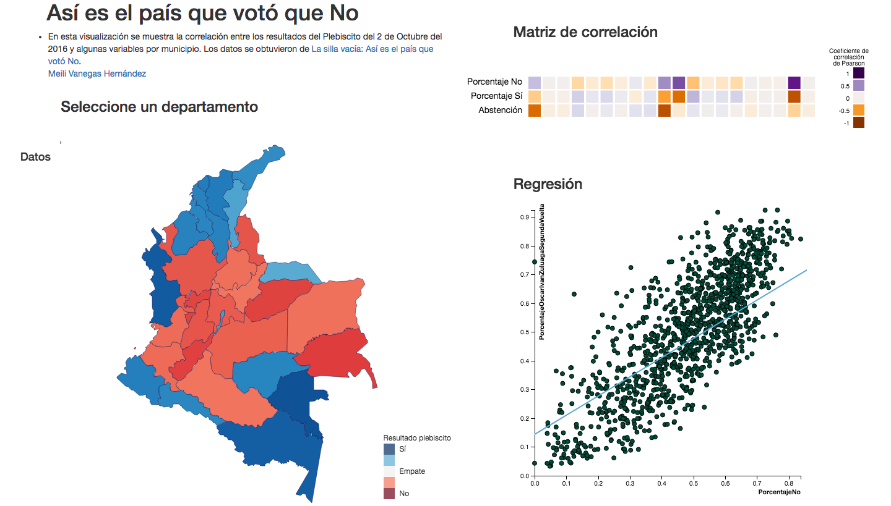

# Plebiscito Colombia 2016
Visualización de la correlación de variables de resultados electorales y características de los municipios con los resultados del plebiscito del 2016 en Colombia.

## Caracterización de los datos

Características de los municipios y sus resultados electorales en las últimas elecciones (**Table**). Cada uno de los items tiene:
- 7 atributos **categóricos** (municipio, departamento, ganador primera vuelta, ganador, afectado por el conflicto pares, zonas de concentración, cultivos ilícitos)
- 27 atributos **ordenados** (votos para senado 2014, porcentaje de Óscar Iván Zuluaga 1ra vuelta, total 1ra vuelta, participación 1ra vuelta, porcentaje de Óscar Iván Zuluaga 2da vuelta, total 2da vuelta, participación 2da vuelta, censo electoral 2016, actos terroristas, amenaza, desplazamiento, homicidio, secuestro, vinculación de niños y adolescentes, minas antipersonal, abandono o despojo de tierras, afectado por el conflicto pares 2, votos por el no, porcentaje no, votos por el sí, porcentaje sí, votos válidos, votos totales, cuántos salieron a votar, índice de ruralidad, hectáreas de coca, hectáreas de amapola).
 
Teniendo en cuenta la diversidad de los datos con los que se cuenta, se proponen las siguientes tareas:
 
- T1. **Discover correlation**: Descubrir la correlación entre variables de resultados electorales del 2014 por municipio y algunas características de los municipios con los resultados del plebiscito del 2016. 
- T2. **Discover distribution**: Descubrir la distribución de los resultados del plebiscito del 2016 en los municipios de Colombia.

## Propuesta de solución

1. Para satisfacer **T1** se desarrollaron dos visualizaciones: 
  - Matriz de correlación: En esta matriz se usan **áreas** (cuadrados) para representar la correlación entre dos variables.  La **región espacial** permite identificar cuando una área corresponde a una variable específica y el **color** permite representar el valor de la correlación entre las dos variables. Como esta variable es **ordenada divergente**, se usa la **luminicencia** entre una **escala de dos tonalidades**.
  - Gráfica de regresión lineal: En esta gráfica se pueden usan **puntos** para representar los valores de la correlación lineal entre dos variables y su **posición en el eje vertical y horizontal** para especificar la cantidad en cada una de las dos variables. Por otro lado, se usa una **línea** para representar la regresión lineal de las variables y su **posición en el eje vertical y horizontal** para indicar las características de la relación.

2. Para satisfacer **T2** se desarrolló una visualización:
  - Un **choropleth map** para representar los porcentajes de votación por el *sí* y por el *no* por medio del **color** para cada uno de los municipios (cada uno de los cuales se clasifica por su **región espacial**).  

# Mockup

## Referencias
- La Silla Vacia: *Así es el país que voto NO*. [Available here](http://lasillavacia.com/hagame-el-cruce/asi-es-el-pais-que-voto-no-58201).

## Autor
<!-- Contributors table START -->
| [ Meili Vanegas](https://github.com/mvanegas10)  |
| :---: |

<!-- Contributors table END -->
